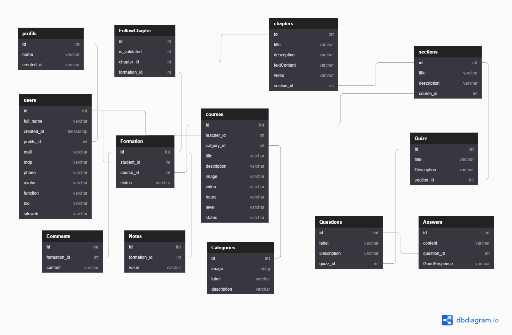

# Tefnout 🚀🔺

## What is Tefnout ?

Tefnout is the first female deity to come into existence in the universe, and with her husband Shou ensures the first sexual procreation of the world.

Having the sun as her headdress, she is the symbol of the solar furnace5, while Shou her brother and husband is that of air, light and life. The two entities are complementary and indispensable to the cycle of life renewal and in the minds of the ancient Egyptians to the assurance that every morning the sun god could be reborn.

## In this context

Tefnout is a complete open source template of an elarning platform with three user levels
Admin, Professor and Students.
This platform enables trainers to make their training available to learners and to enable learners to train independently.

Our platform also allows the administrator to add course categories and validate the instructor courses prior to publication.

    <h4>
    <a href="https://github.com/Louis3797/awesome-readme-template/">View Landing page </a>
   · 
    <a href="https://github.com/Louis3797/awesome-readme-template">View Student-app Demo</a>
   · 
    <a href="https://github.com/Louis3797/awesome-readme-template/issues/">View Admin-app Demo</a>
  </h4>

<!-- Table of Contents -->

# :notebook_with_decorative_cover: Table of Contents

- [About the Project](#star2-about-the-project)
  - [Screenshots](#camera-screenshots)
  - [Tech Stack](#space_invader-tech-stack)
  - [Database Schema](#database-schema)
  - [Features](#dart-features)
- [Getting Started](#toolbox-getting-started)
  - [Prerequisites](#bangbang-prerequisites)
  - [Installation](#gear-installation)
  - [Run Locally](#running-run-locally)
  - [Deployment](#triangular_flag_on_post-deployment)
- [License](#warning-license)
- [Contact](#handshake-contact)

<!-- TechStack -->

### :space_invader: Tech Stack

  
Student and Admin

  <ul>
    <li><a href="https://reactjs.org/">React.js</a></li>
    <li><a href="https://getbootstrap.com/">Bootstrap</a></li>
    <li><a href="https://redux.js.org/">Redux</a></li>
  </ul>

  
Api

  <ul>
    <li><a href="https://www.php.net/docs.php">PHP</a></li>
    <li><a href="https://laravel.com/">Laravel</a></li>
  </ul>

Database

  <ul>
    <li><a href="https://www.mysql.com/">MySQL</a></li>
  </ul>

<!-- Database schema -->

### :database-schema: Database schema

<!-- Features -->

### :dart: Features

- **Student-app [Courses marketplace]**

  - home page
  - courses page
  - filter by category
  - course's details
  - Start a new training
  - Valide a chapter
  - Unvalide a chapter
  - Search course by name
  - Make the review of a course
  - Apply to be an instructor

- **Admin-app**
  - Dashboard
  - USERS CRUD
  - CATEGORIES CRUD
  - REVIEWS LIST
  - SETTINGS
  - COURSES CRUD
